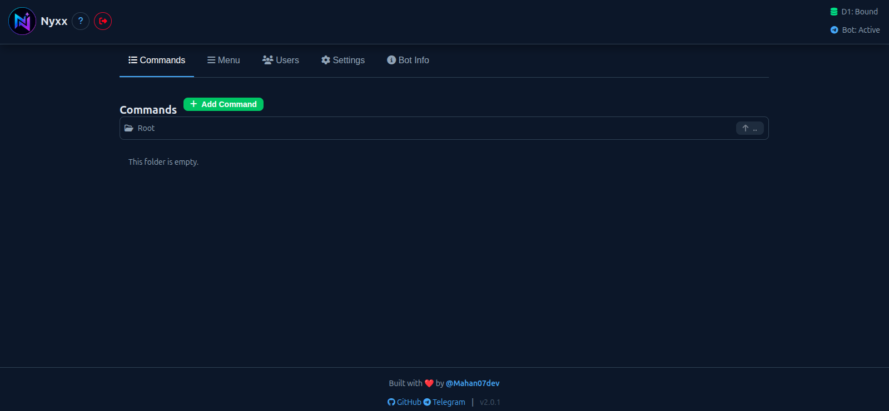

<div align="center">


<br>

# Nyxx

### 🚀 Deploy & Manage Powerful Telegram Bots on Cloudflare Workers

A modern, self-hosted Telegram Bot Builder with an intuitive web dashboard, one-click installation, Cloudflare D1 storage, and zero server maintenance.

<p>
<a href="https://mahan07dev.github.io/Nyxx/installer"></a>
<br><br>
<a href="https://github.com/Mahan07dev/Nyxx/releases">
  
</a>
<a href="https://github.com/Mahan07dev/Nyxx/releases">
  
</a>
<a href="https://github.com/Mahan07dev/Nyxx"></a>
<a href="https://github.com/Mahan07dev/Nyxx/blob/main/LICENSE"></a>
</p>

<p>


</p>

---

**Nyxx** lets you build and manage Telegram bots through a beautiful web dashboard instead of editing code.

Deploy everything to your own Cloudflare account in minutes with the built-in installer. No servers, no VPS, no Docker, and no CLI required.

</div>

---

# 🚀 Get Started

The fastest way to install Nyxx is using the automated installer.

## 👉 https://mahan07dev.github.io/Nyxx/installer

The installer automatically:

- ✅ Creates a Cloudflare Worker
- ✅ Creates a D1 database
- ✅ Binds the database
- ✅ Uploads the latest Worker
- ✅ Deploys everything
- ✅ Gives you your dashboard URL

No manual configuration required.

---

# ✨ Features

## 🤖 Telegram Bot Management

- Create unlimited commands
- Nested command system
- Folder-like command organization
- Enable / Disable commands
- Admin-only commands
- Text responses
- Photo responses
- Automatic webhook management

---

## 🎛️ Beautiful Dashboard

- Modern responsive interface
- Mobile friendly
- Dark UI
- Toast notifications
- Live status indicators
- Secure login system
- Password protected dashboard
- Initial setup wizard

---

## ⌨️ Keyboard Builder

### Inline Keyboards

Create buttons that can:

- Open URLs
- Trigger callbacks
- Navigate to other commands

No JSON editing required.

---

### Reply Keyboards

Create Telegram Reply Keyboards visually.

Perfect for menu-driven bots.

---

## 📋 Telegram Menu Commands

Manage Telegram's built-in menu commands directly from the dashboard.

Publish updates to Telegram with one click.

---

## 👥 User Management

View users who interacted with your bot.

Includes:

- Username
- Display name
- Search support

---

## ⚙️ Bot Settings

Manage everything from one place.

- Bot Token
- Webhook
- Admin Password
- Factory Reset
- Connection Status

---

## ℹ️ Bot Information

Update your bot without leaving Nyxx.

Manage:

- Bot Name
- Description
- Short Description

Publish directly to Telegram.

---

## ☁️ Cloudflare Powered

Built entirely on Cloudflare's infrastructure.

- Cloudflare Workers
- Cloudflare D1
- Global Edge Network
- No traditional hosting

---

# 🖥️ Screenshots

<p align="center">

<a href="screenshots/dashboard.webp">
  
</a>

</p>

---

# ⚡ Why Nyxx?

Unlike many Telegram bot panels that require VPS hosting or complicated setup, Nyxx is designed to be deployed entirely on Cloudflare.

That means:

- Extremely low maintenance
- Global performance
- No server management
- Very generous free tier
- Easy updates
- Secure deployment

---

# 🏗️ Architecture

```
                GitHub Pages
                     │
                     │
              installer.html
                     │
                     ▼
             Cloudflare Proxy
                     │
                     ▼
           Cloudflare REST API
                     │
      ┌──────────────┴──────────────┐
      ▼                             ▼
Cloudflare Worker              Cloudflare D1
      │                             │
      └──────────────┬──────────────┘
                     ▼
             Nyxx Dashboard
                     │
                     ▼
              Telegram Bot API
```

---

# 📂 Repository Structure

```
Nyxx/
│
├── installer.html
│   ├─ One-click installer
│   ├─ Creates Worker
│   ├─ Creates D1
│   └─ Automatic deployment
│
├── worker.js
│   ├─ Telegram Bot Engine
│   ├─ Dashboard
│   ├─ API
│   ├─ Authentication
│   ├─ Command System
│   └─ D1 Database Logic
│
├── proxy.js
│   └─ Cloudflare API proxy used by the installer
│
├── logo.webp
│
└── README.md
```

---

# 📦 Installation

## Option 1 — Automated (Recommended)

Visit:

## 👉 https://mahan07dev.github.io/Nyxx/installer

The installer handles everything automatically.

---

## Option 2 — Manual

If the installer cannot access the Cloudflare API:

1. Deploy `proxy.js` to your own Cloudflare Worker.
2. Replace the proxy URL inside `installer.html`.
3. Open the installer again.
4. Continue the automated installation.

This fallback exists so you're never dependent on a single hosted proxy.

---

# 🔒 Security

Nyxx is designed so that deployment happens directly into **your own Cloudflare account**.

- API tokens remain inside your browser during installation.
- Your Worker runs under your own Cloudflare account.
- Your database belongs to you.
- No third-party server stores your bot data.

> The public proxy only forwards requests to the Cloudflare API. If you prefer, you can deploy your own copy using `proxy.js`.

---

# 📖 Requirements

Before installing you'll need:

- A free Cloudflare account
- A Telegram bot created with **@BotFather**
- A modern web browser

Cloudflare's free plan is sufficient for most personal projects.

---

# 🖥️ Dashboard Overview

Nyxx includes a modern web dashboard where every aspect of your Telegram bot can be managed visually.

## 📁 Commands

Manage your bot like a file explorer.

- Create commands
- Edit commands
- Delete commands
- Organize commands into folders
- Navigate using breadcrumbs
- Enable / Disable commands
- Restrict commands to admins only

---

## 🎹 Inline Keyboard Builder

Create beautiful Telegram inline keyboards without writing JSON.

Supported button types:

| Type | Description |
|------|-------------|
| Callback | Trigger another action |
| Command | Open another command |
| URL | Open websites or channels |

---

## ⌨️ Reply Keyboard Builder

Design Reply Keyboards visually.

Features include:

- Drag & organize buttons
- Link buttons to commands
- Toggle keyboard visibility
- No manual JSON editing

---

## 📋 Telegram Menu

Publish Telegram Menu Commands directly from the dashboard.

Perfect for:

- `/help`
- `/start`
- `/settings`
- `/about`

---

## 👥 Users

View everyone who has interacted with your bot.

Quickly search by:

- Username
- Display name

---

## ⚙️ Settings

Manage everything from a single page.

Available options include:

- Bot Token
- Webhook
- Password
- Factory Reset
- Connection Status

---

## 🤖 Bot Information

Update your bot's profile directly from Nyxx.

Edit:

- Name
- Description
- Short Description

Then publish everything to Telegram instantly.

---

# 📊 Feature Overview

| Feature | Supported |
|-----------|:--------:|
| Cloudflare Workers | ✅ |
| Cloudflare D1 | ✅ |
| Web Dashboard | ✅ |
| Mobile Friendly | ✅ |
| Nested Commands | ✅ |
| Inline Keyboards | ✅ |
| Reply Keyboards | ✅ |
| Telegram Menu Commands | ✅ |
| User Management | ✅ |
| Login Protection | ✅ |
| Admin-only Commands | ✅ |
| Text Responses | ✅ |
| Photo Responses | ✅ |
| Bot Information Editor | ✅ |
| Automatic Webhook | ✅ |
| Factory Reset | ✅ |
| One-click Installer | ✅ |
| Self Hosted | ✅ |

---

# 🔄 Updating Nyxx

Updating is simple.

1. Download the latest release.
2. Replace the Worker code.
3. Deploy again.

Your D1 database and existing bot configuration remain intact.

> Always create a database backup before major updates.

---

# ❓ Frequently Asked Questions

### Is Nyxx free?

Yes.

Nyxx is open-source and designed to work with Cloudflare's generous free plan.

---

### Do I need a VPS?

No.

Everything runs on Cloudflare Workers.

---

### Can I host it myself?

Yes.

Every component belongs to you and can be self-hosted.

---

### What happens if the public proxy goes offline?

Simply deploy your own copy of `proxy.js` and update the proxy URL inside `installer.html`.

The repository includes the proxy source for exactly this reason.

---

### Is my Cloudflare token stored?

No.

The installer is designed so your API token stays inside your browser during installation.

---

### Can I customize the Worker?

Absolutely.

`worker.js` is fully open source and intended to be modified.

---

# 🛣️ Roadmap

Future ideas include:

- [ ] File uploads
- [ ] Video & audio responses
- [ ] Rich media support
- [ ] Multi-language dashboard
- [ ] Scheduled broadcasts
- [ ] Analytics dashboard
- [ ] Import / Export commands
- [ ] Backup & Restore
- [ ] Plugin system
- [ ] Theme customization

---

# 🤝 Contributing

Contributions are always welcome.

You can help by:

- Reporting bugs
- Suggesting features
- Improving documentation
- Opening Pull Requests
- Sharing ideas

Before submitting major changes, please open an issue to discuss your proposal.

---

# ⭐ Support the Project

If Nyxx helped you, consider supporting the project by giving it a ⭐ on GitHub.

It helps more people discover the project and motivates future development.

---

# 📜 License

This project is licensed under the MIT License.

Feel free to use, modify, and distribute it according to the license terms.

---

# ❤️ Credits

Created and maintained by **Mahan (@Mahan07dev)**.

Special thanks to:

- Cloudflare
- Telegram
- Everyone who tests, reports bugs, and contributes to the project.

---

# 📬 Contact

**GitHub**

https://github.com/Mahan07dev

**Telegram**

https://t.me/nyxx_official_channel

---

<div align="center">

## 🚀 Ready to build your own Telegram Bot?

### Start here:

# 👉 https://mahan07dev.github.io/Nyxx/installer

---

Made with ❤️ using Cloudflare Workers & Telegram Bot API.

If you like this project, don't forget to ⭐ the repository.

</div>
